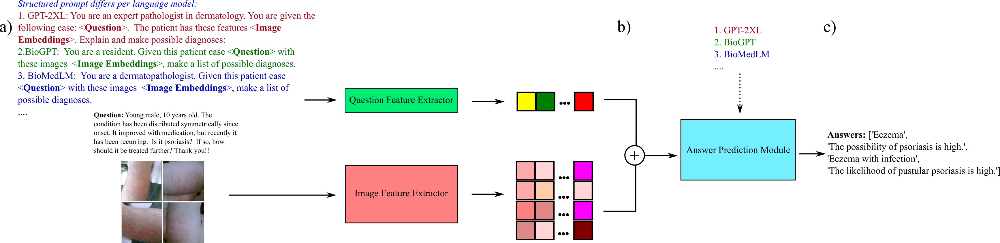
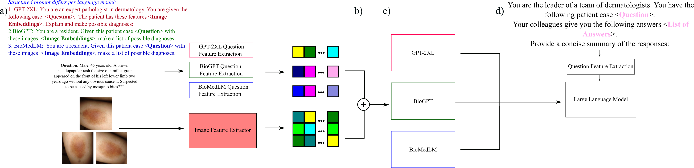

# Collaborative Medical VQA

We propose a pipeline for medical visual question answering on the MEDIQA-M3G benchmark on dermatology cases. It is inspired by literature on multi-agent large language models which leverages multiple, interoperable models which can discuss with each other. The pipeline is highly customizable, and can be tailored for various purposes, such as adopting parameter-efficient finetuning techniques in low-resource settings, or performing retrieval augmented generation for knowledge-based answer generation.  

The training framework is shown below: 

At a) we extract features from the question $\textbf{Q}$ which is constructed differently per each language model, and from the stack of images $\textbf{I}$. At b) we fuse the features to be passed to the language model for free-form answer prediction. At c), each VQA model outputs an answer via greedy search (or beam search with a width of $1$), and is trained by minimizing the cross-entropy loss function between ground-truth tokens and the predicted tokens. In the illustration we depict prompts in Spanish.

The inference framework is depicted as follows:

Similar to training's stage a), we extract features from the question and images, and fuse them at b) so that at c) each of the language models output a list of answers. At d), the answers of each VQA model is put as context for a prompt to a LLM, where we query for a concise answer that accounts for the different diagnoses offered by each model. In the illustration we depict prompts in Spanish.

# MEDIQA-M3G

We can implement the above pipeline to the MEDIQA-M3G Shared Task problem. Please register to the competition at https://sites.google.com/view/mediqa2024/mediqa-m3g and download the training, validation and test sets. We assume you have these directories:

- `mediqa-m3g-startingkit-v2/`
- `m3g-test-ref/`

The paper succintly describing the dataset and results of the competition is in: https://aclanthology.org/2024.clinicalnlp-1.55.pdf

# Framework's Implementation

## Data exploration

You can run some of the jupyter notebooks in Notebooks/ to get familiar with the MEDIQA-M3G dataset.

## Preprocessing

As a preliminary step, and for convenience, you can preprocess the dermatology images and save the feature vectors in `Features/`. You can choose your image encoder:

`python preprocess_images.py` 

By default, the CLIP-based image encoder of [PathGen](https://arxiv.org/abs/2407.00203) is used. 

## Training

The training code is mainly taken from https://github.com/tjvsonsbeek/open-ended-medical-vqa, and you can run with:

`python main.py --split "train"`, where default settings are specified in `args.py` and `CFG.py`. The code finetunes $3$ models mentioned in the paper https://link.springer.com/chapter/10.1007/978-3-031-43904-9_70. These are GPT-2XL, BioGPT from Microsoft, and BioMedLM from Stanford. We implement model compression techniques for memory efficiency during fine-tuning, which includes 1) mixed-precision and 2) gradient accumulation to simulate mini-batch gradient descent. Answers are generated via greedy-search. You can check `train.py` for more details

## Inference

The inference code can be ran with:

`python main.py --split "test"`. The `inference.py` file follows the above framework and combines the output answers of each VQA model into a prompt for a LLM assuming the role of a leader of a team of dermatologists to summarize. The LLM by default is Mistral-7b, and it is 1) quantized, 2) input tensors are loaded with 16-bit precision, 3) and a beam width of $1$ (greedy search) is used for memory efficiency. 

# References

- Ben Abacha, A., Shivade, C., & Demner‐Fushman, D. (2019). Overview of the MEDIQA 2019 Shared Task on Textual Inference, Question Entailment and Question Answering. Proceedings of the 6th Clinical Natural Language Processing Workshop. Association for Computational Linguistics. https://doi.org/10.18653/v1/w19-5039
- Bishop, T. F., Press, M. J., Mendelsohn, J. L., & Casalino, L. P. (2013). Electronic Communication Improves Access, But Barriers To Its Widespread Adoption Remain. Health Affairs, 32(8), 1361–1367. https://doi.org/10.1377/hlthaff.2012.1151
- Deitke, M., Clark, C., Lee, S., Tripathi, R., Yang, Y., Park, J. S., Salehi, M., Muennighoff, N., Lo, K., Soldaini, L., Lu, J., Anderson, T., Bransom, E., Ehsani, K., Ngo, H., Chen, Y., Patel, A., Yatskar, M., Callison-Burch, C., & Head, A. (2024). Molmo and PixMo: Open Weights and Open Data for State-of-the-Art Multimodal Models. ArXiv.org. https://doi.org/10.48550/arXiv.2409.17146
- García, R., & Lithgow-Serrano, O. (2024). NEUI at MEDIQA-M3G 2024: Medical VQA through consensus. Proceedings of the 6th Clinical Natural Language Processing Workshop. Association for Computational Linguistics. https://doi.org/10.18653/v1/2024.clinicalnlp-1.45
- Guo, T., Chen, X., Wang, Y., Chang, R., Pei, S., Chawla, N. V., Wiest, O., & Zhang, X. (2024, January 21). Large Language Model based Multi-Agents: A Survey of Progress and Challenges. ArXiv.org. https://doi.org/10.48550/arXiv.2402.01680
- Hao, J., Sun, W., Xin, X., Meng, Q., Chen, Z., Ren, P., & Ren, Z. (2024). MEFT: Memory-Efficient Fine-Tuning through Sparse Adapter. Proceedings of the 62nd Annual Meeting of the Association for Computational Linguistics (Volume 1: Long Papers), 2375–2388. Association for Computational Linguistics. https://doi.org/10.18653/v1/2024.acl-long.129
- Lester, B., Al-Rfou, R., & Constant, N. (2021). The Power of Scale for Parameter-Efficient Prompt Tuning. Proceedings of the 2021 Conference on Empirical Methods in Natural Language Processing. Association for Computational Linguistics. https://doi.org/10.18653/v1/2021.emnlp-main.243
- Rajeev V, R., Loh, A., Hong, G. E., Singh, P., Smith, M. A., Muralidharan, V., Wong, D., Sayres, R., Phung, M., Betancourt, N., Fong, B., Sahasrabudhe, R., Nasim, K., Eschholz, A., Mustafa, B., Freyberg, J., Spitz, T., Matias, Y., Corrado, G. S., & Chou, K. (2024). Closing the AI generalization gap by adjusting for dermatology condition distribution differences across clinical settings. ArXiv.org. https://doi.org/10.48550/arXiv.2402.15566Saeed, N. (2024). MediFact at MEDIQA-M3G 2024: Medical Question Answering in Dermatology with Multimodal Learning. Arxiv.org. https://arxiv.org/html/2405.01583v1
- Sharma, D., Purushotham, S., & Reddy, C. K. (2021). MedFuseNet: An attention-based multimodal deep learning model for visual question answering in the medical domain. Scientific Reports, 11(1). https://doi.org/10.1038/s41598-021-98390-1
- Steiner, D., & Pilgrim, R. (2024, March 8). Health-specific embedding tools for dermatology and pathology. Google Research. https://research.google/blog/health-specific-embedding-tools-for-dermatology-and-pathology/
- Toma, A., Xie, R., Palayew, S., Bader, G., & Wang, B. (2024). WangLab at MEDIQA-M3G 2024: Multimodal Medical Answer Generation using Large Language Models. Proceedings of the 6th Clinical Natural Language Processing Workshop. Association for Computational Linguistics. https://doi.org/10.18653/v1/2024.clinicalnlp-1.60
- Topol, E. J. (2019). Deep medicine : how artificial intelligence can make healthcare human again. Basic Books.
- van Sonsbeek, T., Mahdi Derakhshani, M., Najdenkoska, I., G. M. Snoek, C., & Worring, M. (2023). Open-Ended Medical Visual Question Answering Through Prefix Tuning of Language Models.  Medical Image Computing and Computer Assisted Intervention – MICCAI 2023 , 726–736. https://doi.org/10.1007/978-3-031-43904-9_70World Health Organization. (2019). Global Health Workforce statistics database. Www.who.int. https://www.who.int/gho/health_workforce/physicians_density/en/
- Yim, W., Ben Abacha, A., Fu, Y., Sun, Z., Xia, F., Yetisgen, M., & Krallinger, M. (2024). Overview of the MEDIQA-M3G 2024 Shared Task on Multilingual Multimodal Medical Answer Generation. Proceedings of the 6th Clinical Natural Language Processing Workshop. Association for Computational Linguistics. https://doi.org/10.18653/v1/2024.clinicalnlp-1.55
- Zhuge, M., Liu, H., Faccio, F., Ashley, D. R., Csordás, R., Gopalakrishnan, A., Hamdi, A., Kader, A., Herrmann, V., Irie, K., Kirsch, L., Li, B., Li, G., Liu, S., Mai, J., Piękos, P., Ramesh, A., Schlag, I., Shi, W., & Stanić, A. (2023). Mindstorms in Natural Language-Based Societies of Mind. Workshop on Robustness of Zero/Few-Shot Learning in Foundation Models . NeurIPS 2023. https://doi.org/10.48550/arXiv.2305.17066

Thanks for reading until here, and if you found this idea interesting, we welcome any feedback on how to improve it. 

